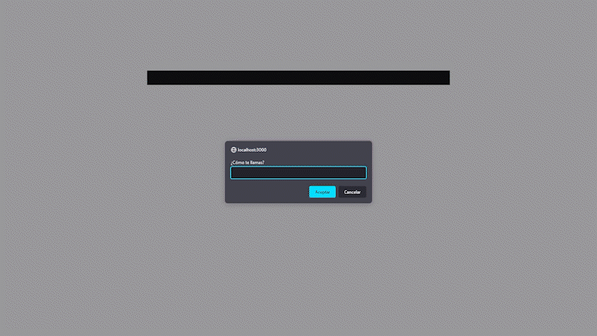

# 📑 CHAT 📑

- He realizado un chat.
  
## 📒ÍNDICE

- [📑 CHAT 📑](#-chat-)
  - [📒ÍNDICE](#índice)
  - [🔰 Acerca de](#-acerca-de)
  - [⚡ Uso](#-uso)
    - [🔌 Instalación](#-instalación)
    - [📦 Comandos](#-comandos)
      - [INDIVIDUAL](#individual)
      - [JUNTO](#junto)
  - [🔧 Desarrollo](#-desarrollo)
    - [📓 Requisitos previos](#-requisitos-previos)
    - [🔩 Entorno de desarrollo](#-entorno-de-desarrollo)
    - [📁 Estructura de archivos](#-estructura-de-archivos)
  - [📷 Galería](#-galería)
  - [🥚Easter eggs🥚](#easter-eggs)
  - [🌟 Crédito/Reconocimiento](#-créditoreconocimiento)

## 🔰 Acerca de

Es un chat en el que se pueden unir usuarios y mandar mensajes entre ellos.

## ⚡ Uso

Para usar este proyecto tienes que instalar todos los modulos, arrancarlo y entrar por el puerto 3000.(En caso de que este ocupado entrara por otro puerto, revisa la terminal de tu editor de codigo). 

### 🔌 Instalación

- se requiere de las siguientes instalaciones:
  - nodejs : adjunto el siguiente [enlace](https://nodejs.org/es/) para la descarga de node
  - socket.io
  - express
  - nodemon

### 📦 Comandos

#### INDIVIDUAL

- npm install node.js
- npm install socket.io
- npm install express
- npm install --save-dev nodemon

#### JUNTO

- npm i node.js socket.io express --save-dev nodemon

## 🔧 Desarrollo

En este proyecto no ha contribuido ninguna otra persona.

### 📓 Requisitos previos

Para poder llevar acabo este proyecto es necesario los siguientes conocimientos:

- HTML
- CSS
- JAVASCRIPT FRONTEND
- JAVASCRIPT BACKEND

### 🔩 Entorno de desarrollo

Para poder descargar el proyecto diríjase a Code > Download ZIP.

### 📁 Estructura de archivos

La estructura de los archivos es la siguiente:

```text
├── 📁 CHAT
│   │  
│   ├── 📁 client
│   │   │
│   │   ├──📁 audio
│   │   │   ├── arriba.mp3
│   │   │   ├── boton.mp3
│   │   │   ├── cena.mp3
│   │   │   ├── okay.mp3
│   │   │   ├── roblox.mp3
│   │   │   ├── snoop.mp3
│   │   │   └── toasty.mp3
│   │   │
│   │   │
│   │   ├──📁 css
│   │   │   └── style.css
│   │   │
│   │   │
│   │   ├──📁 img
│   │   │   ├── chat.gif
│   │   │   ├── john.gif
│   │   │   ├── snoop.gif
│   │   │   └── toasty.gif
│   │   │
│   │   │
│   │   │
│   │   ├──📁 js
│   │   │   └── client.js
│   │   │
│   │   │
│   │   └── index.html
│   │  
│   └──📁 server
│       └── server.js
│  
├── package-lock.json      
│   
├── package.json
│ 
└── README.md
```

## 📷 Galería

  

## 🥚Easter eggs🥚

- COLOR
  
  - $dark
  - $red
  - $green
  - $blue
  - $light
  
- MOVIMIENTO
  
  - $snoop
  - $john
  - $toasty

## 🌟 Crédito/Reconocimiento

Desarrollado por Nicolás Cabrera Rodríguez
